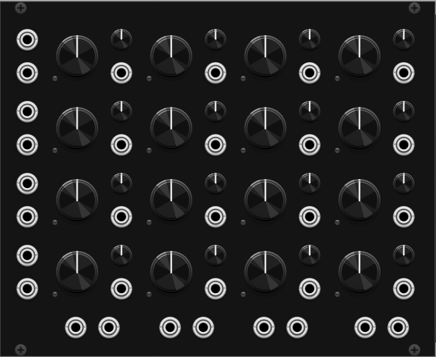

# evrwhr VCV Modules

This repository contains the source code for my VCV Rack modules.

## Modules

### StereoMatrixMixer

A 4x4 matrix mixer with stereo inputs and outputs and dedicated attenuverters for each gain knob.

The module is fully functional, but the panel design needs work :D

